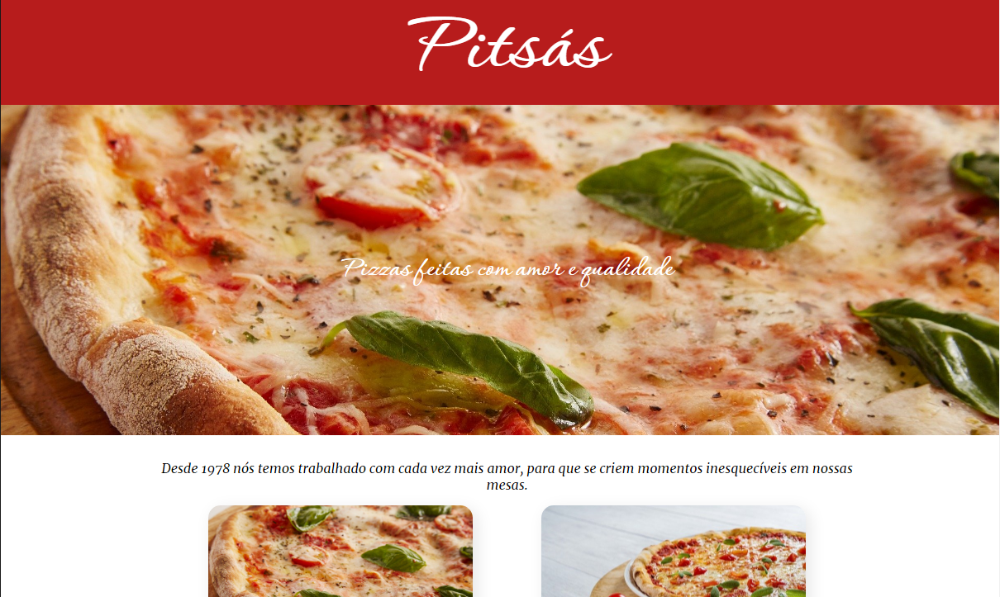
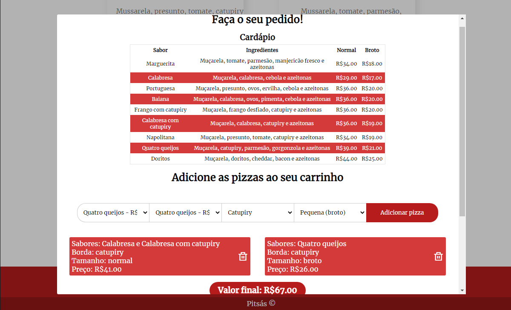

# Pitsás

<!---Esses são exemplos. Veja https://shields.io para outras pessoas ou para personalizar este conjunto de escudos. Você pode querer incluir dependências, status do projeto e informações de licença aqui--->

> Basta apertar o botão de fazer um pedido, e escolher o que quiser!

### Ajustes e melhorias

O projeto ainda está em desenvolvimento e as próximas atualizações serão voltadas nas seguintes tarefas:

- [ ] Aba de bebidas
- [ ] Página de exibição dos pedidos (Privada)
- [ ] Página de gerenciamento do cardápio (Privada)

## ☕ Usando Pitsás

Para usar Pitsás, basta clicar [aqui](https://pitsas.herokuapp.com).
Depois, pressione o botão de fazer pedido, e escolha o que você quiser pedir!

